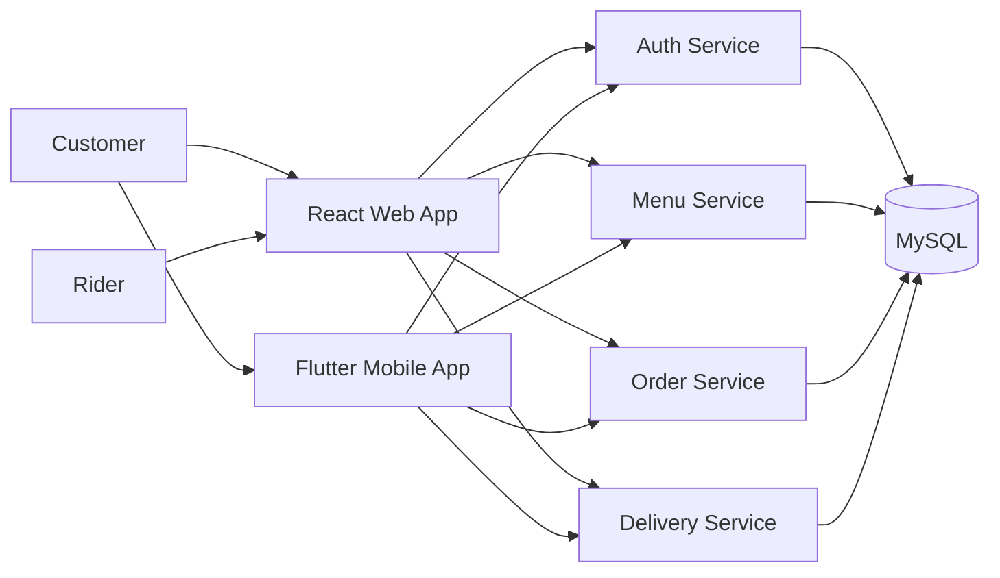
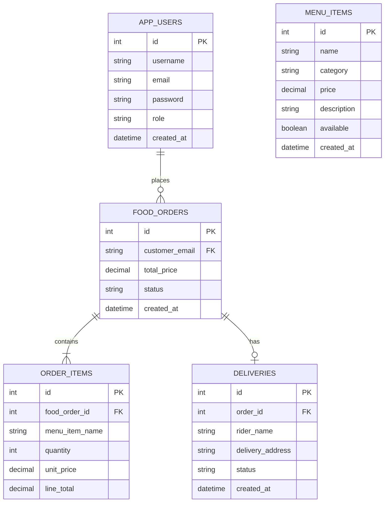

# Food Delivery System

A full-stack food ordering and delivery platform built as a microservices project. The repository contains Spring Boot backend services, a React web client, a Flutter mobile app, Docker Compose for local execution, Terraform infrastructure modules for AWS, and architecture documentation with Mermaid and Word-ready diagrams.

The project models the main food delivery workflow: users register and log in with JWT authentication, browse menu items, create orders, and track deliveries handled by riders.

## Table of Contents

- [Project Overview](#project-overview)
- [Main Features](#main-features)
- [Architecture Summary](#architecture-summary)
- [Technology Stack](#technology-stack)
- [Repository Structure](#repository-structure)
- [Backend Microservices](#backend-microservices)
- [Frontend Web Application](#frontend-web-application)
- [Flutter Mobile Application](#flutter-mobile-application)
- [Database Model](#database-model)
- [API Endpoints](#api-endpoints)
- [Architecture Diagrams](#architecture-diagrams)
- [Local Development](#local-development)
- [Docker Compose](#docker-compose)
- [AWS Infrastructure](#aws-infrastructure)
- [Testing and Validation](#testing-and-validation)
- [Known Notes](#known-notes)
- [Future Improvements](#future-improvements)

## Project Overview

The Food Delivery System is organized around separate services for authentication, menu management, order management, and delivery tracking. Each backend service owns its own controller, DTOs, service layer, repository, JPA entities, validation, and configuration.

The project currently includes:

- `auth-service` for registration, login, JWT generation, and authenticated user lookup.
- `menu-service` for creating and reading menu items.
- `order-service` for creating and reading food orders with order items.
- `delivery-service` for creating deliveries and updating delivery status.
- `recommendation-service` placeholder for future recommendation features.
- `frontend-web` React/Vite customer and rider interface.
- `mobile_flutter` Flutter client scaffold with HTTP and shared preferences dependencies.
- `docker-compose.yml` for local MySQL and backend service orchestration.
- `infra/terraform` modules for AWS VPC, EKS, and RDS.
- `docs/architecture` containing generated diagrams, Mermaid source, and a Word document.

## Main Features

- User registration with duplicate email and username validation.
- Password hashing through Spring Security `PasswordEncoder`.
- JWT generation for authenticated user sessions.
- Login by email and password.
- Menu item creation and retrieval.
- Order creation with line-item totals and aggregate total calculation.
- Order retrieval by ID and list endpoint.
- Delivery creation for an order.
- Delivery status updates.
- React web screens for landing, login, registration, catalog, checkout, tracking, rider dashboard, and profile.
- Dockerized local backend environment.
- Terraform-defined AWS development infrastructure.
- Architecture documentation in Markdown, Mermaid, PNG, and `.docx` formats.

## Architecture Summary

At a high level, the system follows this structure:



The local runtime uses Docker Compose with one MySQL database and four Spring Boot services. The AWS infrastructure code describes a dev environment with network, EKS, and RDS modules.

## Technology Stack

### Backend

- Java 21
- Spring Boot 4.0.5
- Spring Web MVC
- Spring Data JPA
- Spring Security
- Spring Validation
- Spring Actuator
- JJWT `0.12.6`
- MySQL Connector/J
- Maven

### Frontend Web

- React 19
- Vite
- React Router
- Axios
- ESLint

### Mobile

- Flutter
- Dart SDK `^3.11.3`
- `http`
- `shared_preferences`

### Local Runtime

- Docker
- Docker Compose
- MySQL 8.0

### Infrastructure

- Terraform
- AWS VPC
- AWS EKS
- AWS RDS
- AWS provider `5.100.0`

### Documentation

- Mermaid diagrams
- Generated PNG diagrams
- Word-compatible `.docx` architecture document
- Python diagram generator using `python-docx` and `Pillow`

## Repository Structure

```text
food-delivery-system/
|-- docs/
|   |-- api/
|   |-- architecture/
|   |   |-- diagrams/
|   |   |-- diagrams.md
|   |   |-- figure-4-erd-food-delivery.md
|   |   |-- figure-4-user-registration-jwt-login.md
|   |   |-- food-delivery-system-diagrams.docx
|   |   `-- generate_diagrams.py
|   `-- screenshots/
|-- frontend-web/
|   |-- public/
|   `-- src/
|       |-- api/
|       |-- components/
|       |-- data/
|       |-- pages/
|       |-- routes/
|       |-- styles/
|       `-- utils/
|-- infra/
|   `-- terraform/
|       |-- envs/dev/
|       `-- modules/
|           |-- eks/
|           |-- network/
|           `-- rds/
|-- mobile_flutter/
|   |-- android/
|   |-- ios/
|   |-- lib/
|   |-- test/
|   `-- web/
|-- services/
|   |-- auth-service/
|   |-- delivery-service/
|   |-- menu-service/
|   |-- order-service/
|   `-- recommendation-service/
|-- docker-compose.yml
`-- README.md
```

## Backend Microservices

### Auth Service

Path: `services/auth-service`

Port: `8080`

Responsibilities:

- Register customers.
- Validate duplicate email and username.
- Hash passwords.
- Generate JWT tokens.
- Authenticate users during login.
- Expose authenticated user details through `/auth/me`.

Important classes:

- `AuthController`
- `AuthService`
- `JwtService`
- `JwtAuthenticationFilter`
- `UserRepository`
- `User`
- `Role`

### Menu Service

Path: `services/menu-service`

Port: `8081`

Responsibilities:

- Create menu items.
- List all menu items.
- Fetch a menu item by ID.
- Seed sample data through the menu configuration layer.

Important classes:

- `MenuController`
- `MenuService`
- `MenuItemRepository`
- `MenuItem`
- `DataSeeder`

### Order Service

Path: `services/order-service`

Port: `8082`

Responsibilities:

- Create food orders.
- Store order items.
- Calculate line totals.
- Calculate order total price.
- Return order details and order lists.

Important classes:

- `OrderController`
- `OrderService`
- `FoodOrderRepository`
- `FoodOrder`
- `OrderItem`
- `OrderStatus`

### Delivery Service

Path: `services/delivery-service`

Port: `8083`

Responsibilities:

- Create delivery records for orders.
- Assign rider name and delivery address.
- Track delivery status.
- Update delivery status by ID.

Important classes:

- `DeliveryController`
- `DeliveryService`
- `DeliveryRepository`
- `Delivery`
- `DeliveryStatus`

### Recommendation Service

Path: `services/recommendation-service`

Current status: placeholder only. The folder exists for future recommendation features, but there is no implemented service code yet.

## Frontend Web Application

Path: `frontend-web`

The web application is built with React and Vite. It uses Axios for API calls and React Router for navigation.

Main pages:

- `LandingPage`
- `CustomerLoginPage`
- `CustomerRegisterPage`
- `FoodCatalogPage`
- `CheckoutPage`
- `OrderTrackingPage`
- `RiderDashboardPage`
- `ProfilePage`

Main routes:

| Route | Page |
| --- | --- |
| `/` | Landing page |
| `/login` | Customer login |
| `/register` | Customer registration |
| `/catalog` | Food catalog |
| `/checkout` | Checkout |
| `/tracking` | Order tracking |
| `/rider` | Rider dashboard |
| `/profile` | Customer profile |

Frontend scripts:

```bash
cd frontend-web
npm install
npm run dev
npm run build
npm run lint
```

## Flutter Mobile Application

Path: `mobile_flutter`

The Flutter application is included as the mobile client. It is configured with:

- Material icons
- `http` for backend API calls
- `shared_preferences` for local persistence
- Standard Android, iOS, web, desktop, and test folders

Common commands:

```bash
cd mobile_flutter
flutter pub get
flutter run
flutter test
```

## Database Model

The active local database is MySQL. Docker Compose creates a MySQL 8.0 container named `food-mysql` with database `foodauthdb`.

Main tables represented by JPA entities:

- `app_users`
- `menu_items`
- `food_orders`
- `order_items`
- `deliveries`

Crow's-foot ERD source:

- `docs/architecture/figure-4-erd-food-delivery.md`



Note: `ORDER_ITEMS.food_order_id` is an explicit JPA relationship. `FOOD_ORDERS.customer_email` and `DELIVERIES.order_id` are logical references stored as values in the current implementation.

## API Endpoints

### Auth Service

Base path: `/auth`

| Method | Endpoint | Description |
| --- | --- | --- |
| `GET` | `/auth/health` | Service health check |
| `POST` | `/auth/register` | Register a new customer and return JWT |
| `POST` | `/auth/login` | Log in and return JWT |
| `GET` | `/auth/me` | Return authenticated user details |

Example registration request:

```json
{
  "username": "customer1",
  "email": "customer1@example.com",
  "password": "password123"
}
```

Example auth response:

```json
{
  "message": "User registered successfully",
  "username": "customer1",
  "email": "customer1@example.com",
  "role": "CUSTOMER",
  "token": "jwt-token"
}
```

### Menu Service

Base path: `/menu`

| Method | Endpoint | Description |
| --- | --- | --- |
| `GET` | `/menu/health` | Service health check |
| `POST` | `/menu` | Create menu item |
| `GET` | `/menu` | List menu items |
| `GET` | `/menu/{id}` | Get menu item by ID |

Example menu item request:

```json
{
  "name": "Chicken Burger",
  "category": "Burger",
  "price": 8.99,
  "description": "Grilled chicken burger with sauce",
  "available": true
}
```

### Order Service

Base path: `/orders`

| Method | Endpoint | Description |
| --- | --- | --- |
| `GET` | `/orders/health` | Service health check |
| `POST` | `/orders` | Create order |
| `GET` | `/orders` | List orders |
| `GET` | `/orders/{id}` | Get order by ID |

Example order request:

```json
{
  "customerEmail": "customer1@example.com",
  "items": [
    {
      "menuItemName": "Chicken Burger",
      "quantity": 2,
      "unitPrice": 8.99
    }
  ]
}
```

### Delivery Service

Base path: `/deliveries`

| Method | Endpoint | Description |
| --- | --- | --- |
| `GET` | `/deliveries/health` | Service health check |
| `POST` | `/deliveries` | Create delivery |
| `GET` | `/deliveries` | List deliveries |
| `GET` | `/deliveries/{id}` | Get delivery by ID |
| `PATCH` | `/deliveries/{id}/status` | Update delivery status |

Example delivery request:

```json
{
  "orderId": 1,
  "riderName": "Rider One",
  "deliveryAddress": "123 Main Street"
}
```

Example status update:

```json
{
  "status": "DELIVERED"
}
```

## Architecture Diagrams

Architecture documentation is stored in `docs/architecture`.

Generated Word document:

- `docs/architecture/food-delivery-system-diagrams.docx`

Generated PNG diagrams:

- `docs/architecture/diagrams/01-system-context.png`
- `docs/architecture/diagrams/02-component-architecture.png`
- `docs/architecture/diagrams/03-deployment-architecture.png`
- `docs/architecture/diagrams/04-order-workflow-sequence.png`
- `docs/architecture/diagrams/05-entity-relationship.png`
- `docs/architecture/diagrams/06-api-endpoints.png`
- `docs/architecture/diagrams/07-frontend-navigation.png`
- `docs/architecture/diagrams/08-use-cases.png`

Focused Mermaid diagrams:

- `docs/architecture/figure-4-erd-food-delivery.md`
- `docs/architecture/figure-4-user-registration-jwt-login.md`
- `docs/architecture/diagrams.md`

Diagram generator:

```bash
python docs/architecture/generate_diagrams.py
```

The generator creates light-background PNG diagrams and a Word-compatible `.docx` document.

## User Registration and JWT Login Sequence

The registration and login behavior is documented in:

- `docs/architecture/figure-4-user-registration-jwt-login.md`

Summary:

1. User enters registration information.
2. Client sends `POST /auth/register`.
3. Auth service checks duplicate email and username.
4. Password is hashed.
5. User is saved to MySQL.
6. JWT is generated with email and role.
7. Client receives the token.
8. User logs in later using email and password.
9. Auth service verifies password and returns a new JWT.

## Local Development

### Prerequisites

- Java 21
- Maven or service-specific Maven wrapper
- Node.js and npm
- Flutter SDK
- Docker and Docker Compose
- Terraform for infrastructure work

### Environment Variables

Backend services expect:

```bash
DB_URL=jdbc:mysql://localhost:3306/foodauthdb?useSSL=false&allowPublicKeyRetrieval=true&serverTimezone=UTC
DB_USERNAME=admin
DB_PASSWORD=admin123
JWT_SECRET=foodDeliverySystemSuperSecretKeyForJwtToken123456
```

Only `auth-service` uses `JWT_SECRET`.

### Run Services Manually

Start MySQL first, then run each service from its folder.

```bash
cd services/auth-service
./mvnw spring-boot:run
```

```bash
cd services/menu-service
./mvnw spring-boot:run
```

```bash
cd services/order-service
./mvnw spring-boot:run
```

```bash
cd services/delivery-service
./mvnw spring-boot:run
```

On Windows PowerShell, use:

```powershell
.\mvnw.cmd spring-boot:run
```

## Docker Compose

The root `docker-compose.yml` starts:

- `mysql` on port `3306`
- `auth-service` on port `8080`
- `menu-service` on port `8081`
- `order-service` on port `8082`
- `delivery-service` on port `8083`

Run:

```bash
docker compose up --build
```

Stop:

```bash
docker compose down
```

Stop and remove MySQL volume:

```bash
docker compose down -v
```

## AWS Infrastructure

Terraform lives in `infra/terraform`.

Environment:

- `infra/terraform/envs/dev`

Modules:

- `infra/terraform/modules/network`
- `infra/terraform/modules/eks`
- `infra/terraform/modules/rds`

The dev environment creates or configures:

- Project/environment naming prefix.
- VPC networking.
- Public and private subnets.
- EKS cluster.
- EKS node configuration.
- RDS database.
- Terraform outputs for VPC, subnet, EKS, and RDS values.

Typical Terraform workflow:

```bash
cd infra/terraform/envs/dev
terraform init
terraform plan
terraform apply
```

Do not commit real production secrets or live cloud credentials. Review `terraform.tfvars` before publishing publicly.

## Testing and Validation

Backend service tests:

```bash
cd services/auth-service
./mvnw test
```

```bash
cd services/menu-service
./mvnw test
```

```bash
cd services/order-service
./mvnw test
```

```bash
cd services/delivery-service
./mvnw test
```

Frontend validation:

```bash
cd frontend-web
npm run lint
npm run build
```

Flutter validation:

```bash
cd mobile_flutter
flutter test
```

## Known Notes

- The README documents the current implementation, not only the original plan.
- MySQL is the active local database. PostgreSQL, Redis, Kafka, Istio, CloudFront, ACM, Route 53, Helm, Grafana, and Promtail are not fully wired in the current codebase.
- `recommendation-service` currently contains only a placeholder.
- `FOOD_ORDERS.customer_email` and `DELIVERIES.order_id` are logical references in code. Only `FoodOrder` to `OrderItem` is modeled as an explicit JPA entity relationship.
- The generated diagrams are useful for documentation, but the focused Mermaid ERD is the preferred source for the final database diagram.

## Future Improvements

- Implement recommendation service.
- Add API gateway or ingress routing for all backend services.
- Add service-to-service validation between order, menu, and delivery domains.
- Add refresh tokens and token revocation.
- Add role-specific authorization for customer, admin, and rider actions.
- Add payment service.
- Add restaurant/vendor management.
- Add automated CI builds for backend, frontend, and Flutter.
- Add Kubernetes manifests or Helm charts for EKS deployment.
- Add observability with metrics, logs, and dashboards.
- Add complete OpenAPI documentation under `docs/api`.

## Status

The core food delivery workflow is implemented across backend services and web/mobile clients. Documentation has been expanded with architecture diagrams, Mermaid diagrams, and a GitHub-ready project README.
